# AIT - Lab 04 - Docker and Dynamic Scaling

**Authors: Nathanaël Mizutani, Olivier Koffi**

### Table of Content
1. [Introduction](#introduction)
2. [Task 0: Identify issues and install the tools](#task0)
3. [Task 1: Add a process supervisor to run several processes](#task1)
4. [Task 2: Add a tool to manage membership in the web server cluster](#task2)
5. [Task 3: React to membership changes](#task3)
6. [Task 4: Use a template engine to easily generate configuration files](#task4)
7. [Task 5: Generate a new load balancer configuration when membership changes](#task5)
8. [Task 6: Make the load balancer automatically reload the new configuration](#task6)
9. [Difficulties](#difficulties)
10. [Conlcusion](#conclusion)

## Introduction <a name="introduction"></a>

The laboratory instructions can be found [here](../README.md).<br/>
The upstream repo of this repo can be found [here](https://github.com/SoftEng-HEIGVD/Teaching-HEIGVD-AIT-2019-Labo-Docker).

In this laboratory we will learn to build our own Docker images and become familiar with process supervision for Docker. We will also see the core concpts for dynammic scaling of an application in production.
Finally we will put into practice decentralized management of web server instance.

## Task 0: Identify issues and install the tools <a name="task0"></a>

### Questions

**M1** <br/>
**Do you think we can use the current solution for a production environment? What are the main problems when deploying it in a production environment?**

The current solution cannot be used in a production environment. The main problem is that we miss a "node manager".<br/>
For example, if one backend node unexpectedly crashed, it cannot be automatically restarted.<br/>
Also if we want to add a new nodes, configuration files must be manually modified and the HA Proxy must be manually restart.<br/>


**M2** <br/>
**Describe what you need to do to add new webapp container to the infrastructure. Give the exact steps of what you have to do without modifiying the way the things are done. Hint: You probably have to modify some configuration and script files in a Docker image.**

In order to add a new webapp, we must modify :
* Step 1:  docker-compose.yml; Add a new service (webapp3) and add "WEBAPP_3_IP" in HAProxy environment section.
* Step 2: haproxy.cfg; Add the new backend node in the configuration.
* Step 2: Rebuild the HAProxy image (in order to copy the new configuration in it).
* Step 3: Stop and kill all running containers.
* Step 4: Restart all containers with `docker run` or `docker-compose`

See [Task 6](#task6).

**M3** <br/>
**Based on your previous answers, you have detected some issues in the current solution. Now propose a better approach at a high level.**

One possible approach is to use implement [Serf](https://www.serf.io/) to manage nodes.<br/>
Serf is explained in [Task 1](#task1).


**M4** <br/>
**You probably noticed that the list of web application nodes is hardcoded in the load balancer configuration. How can we manage the web app nodes in a more dynamic fashion?**

We can use a template engine to dynamically (re)generate configuration files.<br/>
See [Task 3](#task3), [Task 4](#task4), [Task 5](#task5)

**M5** <br/>
**In the physical or virtual machines of a typical infrastructure we tend to have not only one main process (like the web server or the load balancer) running, but a few additional processes on the side to perform management tasks.**

**For example to monitor the distributed system as a whole it is common to collect in one centralized place all the logs produced by the different machines. Therefore we need a process running on each machine that will forward the logs to the central place. (We could also imagine a central tool that reaches out to each machine to gather the logs. That's a push vs. pull problem.) It is quite common to see a push mechanism used for this kind of task.**

**Do you think our current solution is able to run additional management processes beside the main web server / load balancer process in a container? If no, what is missing / required to reach the goal? If yes, how to proceed to run for example a log forwarding process?**

No, we miss a process supervisor (as S6) that can manage all processes we want to launch in our containers. <br/>
S6 in configured and explained in [Task 1](#task1).

**M6** <br/>
**In our current solution, although the load balancer configuration is changing dynamically, it doesn't follow dynamically the configuration of our distributed system when web servers are added or removed. If we take a closer look at the run.sh script, we see two calls to sed which will replace two lines in the haproxy.cfg configuration file just before we start haproxy. You clearly see that the configuration file has two lines and the script will replace these two lines.**

**What happens if we add more web server nodes? Do you think it is really dynamic? It's far away from being a dynamic configuration. Can you propose a solution to solve this?**

It's not really dynamic because if we add a new web server node, it won't be added in `haproxy.cfg` file automatically. One solution to solve this problem is to use a template engine as Handlebars as explained in the [Task 4](#task4).

### Deliverables
**Take a screenshot of the stats page of HAProxy at http://192.168.42.42:1936. You should see your backend nodes.**

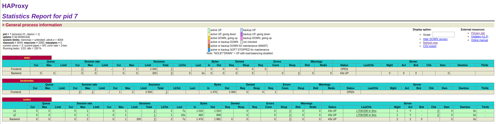

**Give the URL of your repository URL in the lab report.**

https://github.com/NatMiz/Teaching-HEIGVD-AIT-2019-Labo-Docker

## Task 1: Add a process supervisor to run several processes <a name="task1"></a>

### Deliverables
**Take a screenshot of the stats page of HAProxy at http://192.168.42.42:1936. You should see your backend nodes. It should be really similar to the screenshot of the previous task.**

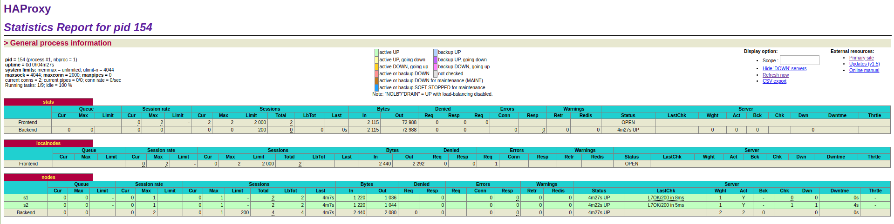

**Describe your difficulties for this task and your understanding of what is happening during this task. Explain in your own words why are we installing a process supervisor. Do not hesitate to do more research and to find more articles on that topic to illustrate the problem.**

There was no special difficulties for this task because each steps are well explained.<br/>
In this task, we configured containers to be able to run several processes.<br/>
By default, a container can only run one process so we use S6, a process supervisor, to run (fork) others processes.<br/>
Finally, we configured S6 to run our webapp server. With this technique, we are now able to run several processes through the S6 configuration.

## Task 2: Add a tool to manage membership in the web server cluster <a name="task2"></a>

### Deliverables

**Provide the docker log output for each of the containers: ha, s1 and s2. You need to create a folder logs in your repository to store the files separately from the lab report. For each lab task create a folder and name it using the task number. No need to create a folder when there are no logs.**

**HA logs**

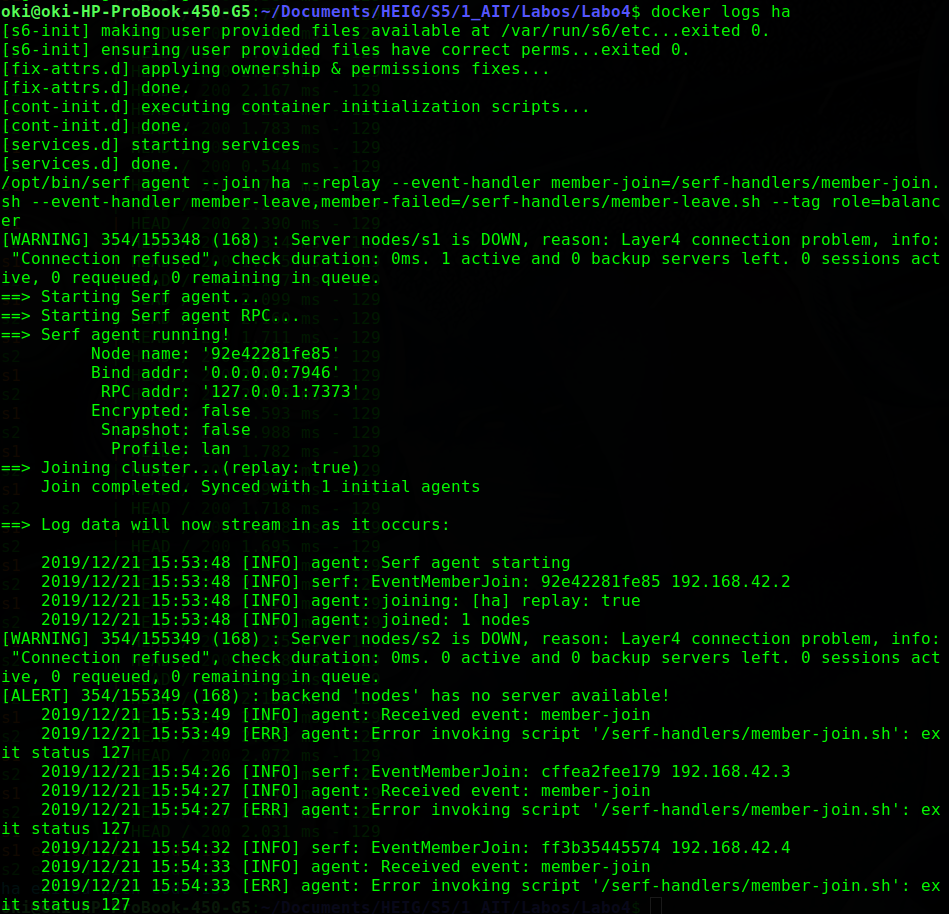

**S1 logs**

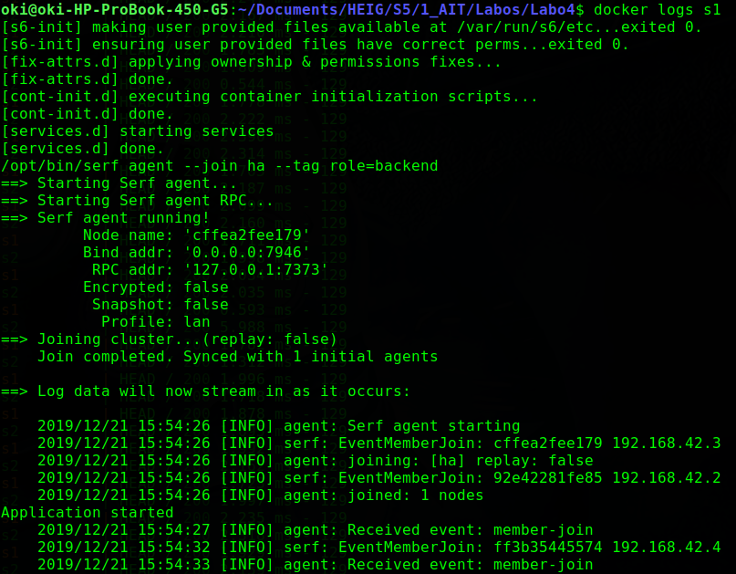

**S2 logs**

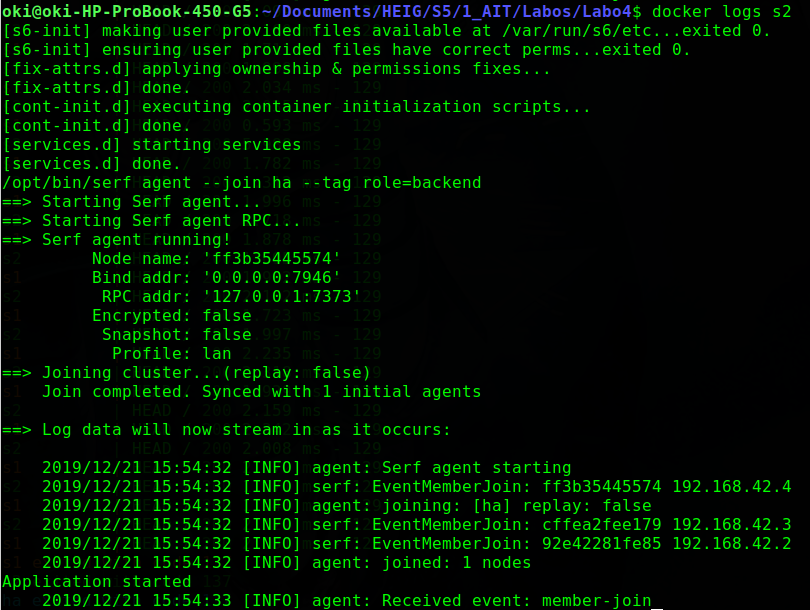

**Give the answer to the question about the existing problem with the current solution.**

See the response of [M1](#task0).

**Give an explanation on how Serf is working. Read the official website to get more details about the GOSSIP protocol used in Serf. Try to find other solutions that can be used to solve similar situations where we need some auto-discovery mechanism.**

Serf is a tool for cluster membership, failure detection, and orchestration that is decentralized, fault-tolerant and highly available. Serf uses a gossip protocol to broadcast messages to the cluster.<br/>
The concept is that gossip messages are sent periodically between random nodes. If a node is down, the information is quickly spread on the others nodes.

[Sources Serf](https://www.serf.io/)

Another solution would be to choose another tool that use a gossip protocol such as [Mesh](https://github.com/weaveworks/mesh).<br/>
Mesh implements a gossip protocol that provide membership, unicast, and broadcast functionality with eventually-consistent semantics.


## Task 3: React to membership changes <a name="task3"></a>

### Deliverables

**Provide the docker log output for each of the containers: ha, s1 and s2. Put your logs in the logs directory you created in the previous task.**

**HA**

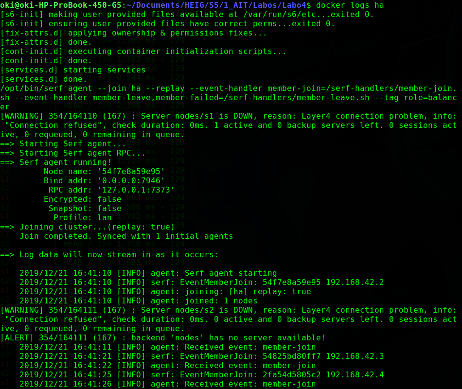

**S1**

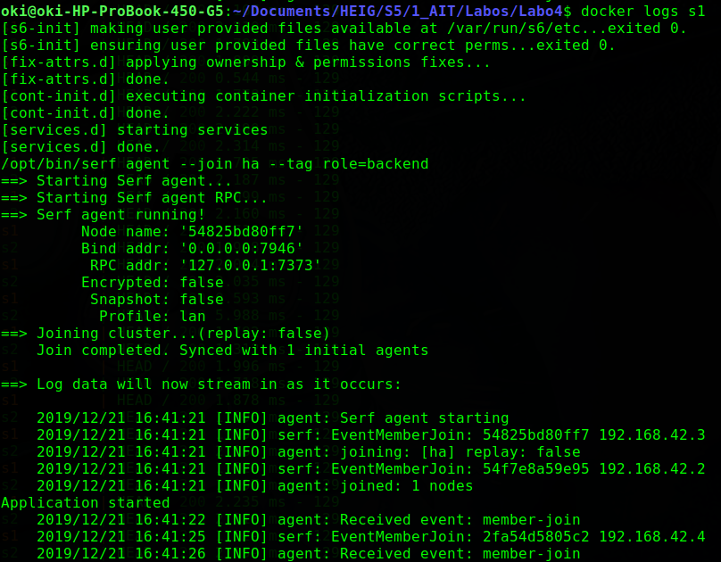

**S2**

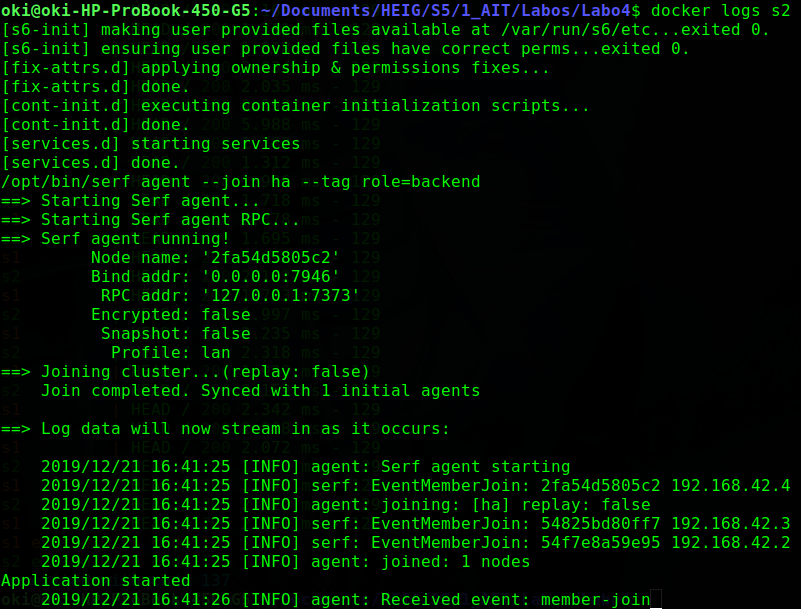

**Provide the logs from the ha container gathered directly from the /var/log/serf.log file present in the container. Put the logs in the logs directory in your repo.**

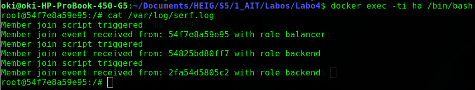

## Task 4: Use a template engine to easily generate configuration files <a name="task4"></a>

### Deliverables

**You probably noticed when we added xz-utils, we have to rebuild the whole image which took some time. What can we do to mitigate that? Take a look at the Docker documentation on image layers. Tell us about the pros and cons to merge as much as possible of the command. In other words, compare:**
```
RUN command 1
RUN command 2
RUN command 3
```
vs.
```
RUN command 1 && command 2 && command 3
```

Only the instructions RUN, COPY, ADD create layers. Other instructions create temporary intermediate images, and do not increase the size of the build. In older versions of Docker, it was important that you minimized the number of layers in your images to ensure they were performant.

However it's not always possible to stick all commands in one `RUN`. Sometimes you need to copy after and before a command for example.

[Sources](https://docs.docker.com/develop/develop-images/dockerfile_best-practices/)

**Propose a different approach to architecture our images to be able to reuse as much as possible what we have done. Your proposition should also try to avoid as much as possible repetitions between your images.**

We could regroup as much as possible `RUN` and `COPY` commands without changing the behaviour.<br/>
We could already run some commands like `curl` or `npm install` in a container and then commit an image and use it to avoid to "rerun" all of this commands at each `docker run`.

**Provide the /tmp/haproxy.cfg file generated in the ha container after each step. Place the output into the logs folder like you already did for the Docker logs in the previous tasks. Three files are expected.**

**After HA started**

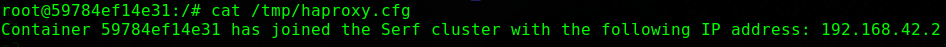

**After S1 started**

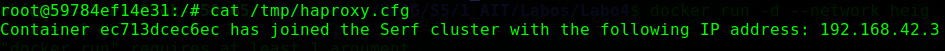

**After S2 started**

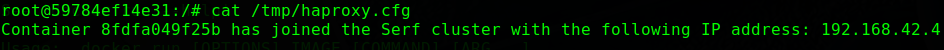


**In addition, provide a log file containing the output of the docker ps console and another file (per container) with docker inspect <container>. Four files are expected.**

#### Docker ps command

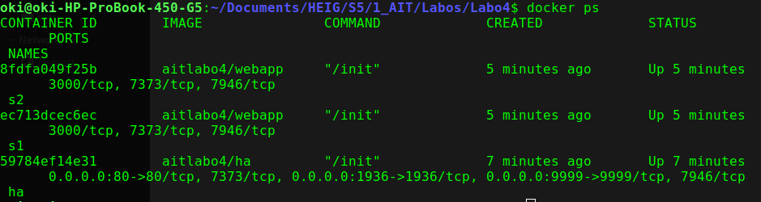

#### Docker inspect files

[HA](logs/task4/inspect_ha.log),
[S1](logs/task4/inspect_s1.log),
[S2](logs/task4/inspect_s2.log)

**Based on the three output files you have collected, what can you say about the way we generate it? What is the problem if any?**

## Task 5: Generate a new load balancer configuration when membership changes <a name="task5"></a>

### Deliverables

**Provide the file /usr/local/etc/haproxy/haproxy.cfg generated in the ha container after each step. Three files are expected.**

**After HA started**

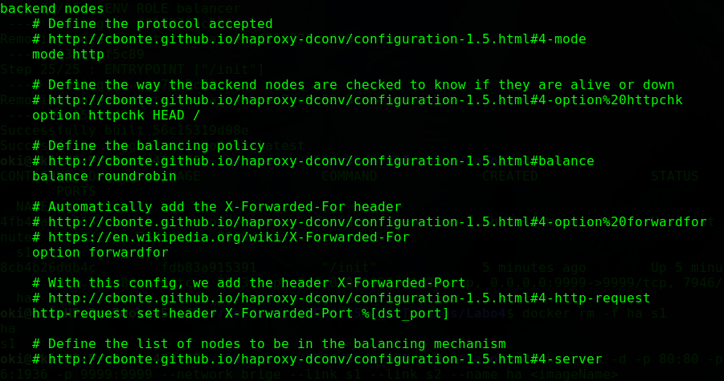

**After S1 started**

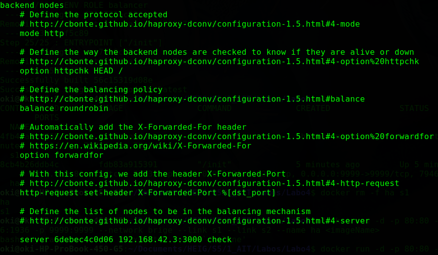

**After S2 started**

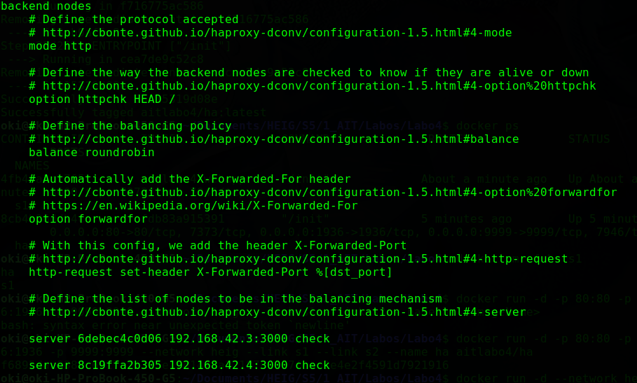

**In addition, provide a log file containing the output of the docker ps console and another file (per container) with docker inspect <container>. Four files are expected.**

**Docker ps command**

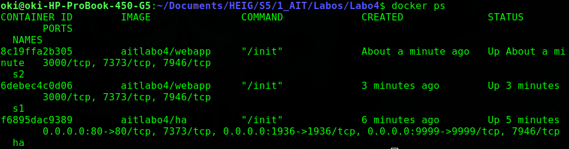

**Docker inspect files**

[HA](logs/task5/inspect_ha.log),
[S1](logs/task5/inspect_s1.log),
[S2](logs/task5/inspect_s2.log)


**Provide the list of files from the /nodes folder inside the ha container. One file expected with the command output.**

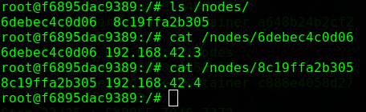


**Provide the configuration file after you stopped one container and the list of nodes present in the /nodes folder. One file expected with the command output. Two files are expected.**

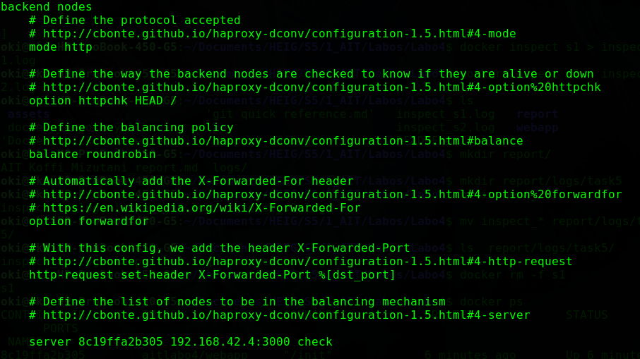

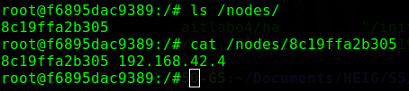

**In addition, provide a log file containing the output of the docker ps console. One file expected.**

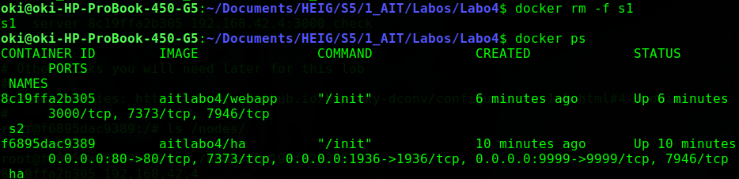

**(Optional:) Propose a different approach to manage the list of backend nodes. You do not need to implement it. You can also propose your own tools or the ones you discovered online. In that case, do not forget to cite your references.**

We could use another service as [Apache Zookeeper](https://zookeeper.apache.org/) which is a centralized service for maintaining configuration information, naming, providing distributed synchronization, and providing group services.

## Task 6: Make the load balancer automatically reload the new configuration <a name="task6"></a>

### Deliverables

**Take a screenshots of the HAProxy stat page showing more than 2 web applications running. Additional screenshots are welcome to see a sequence of experimentations like shutting down a node and starting more nodes.<br/>
Also provide the output of docker ps in a log file. At least one file is expected. You can provide one output per step of your experimentation according to your screenshots.**

**After HA, S1, S2, S3 and S4 started**

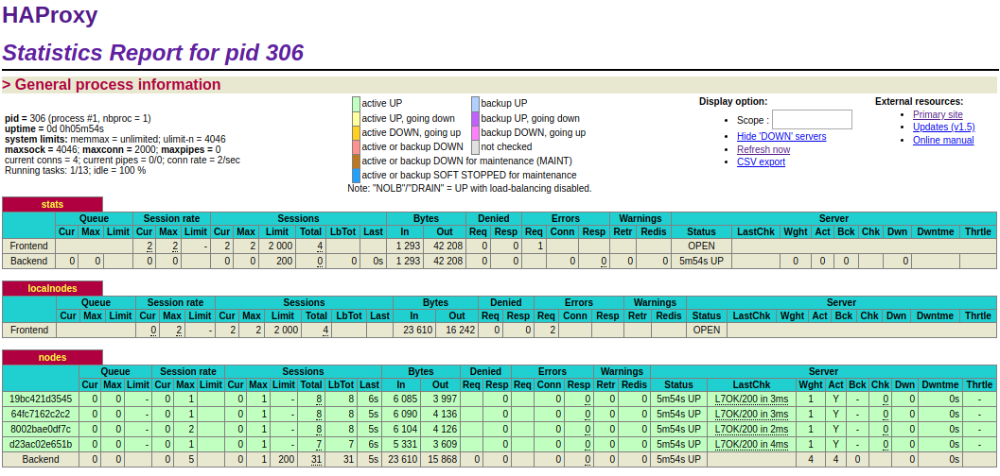

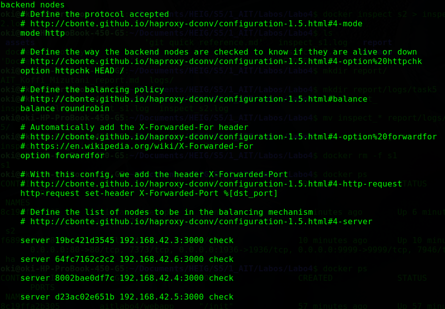

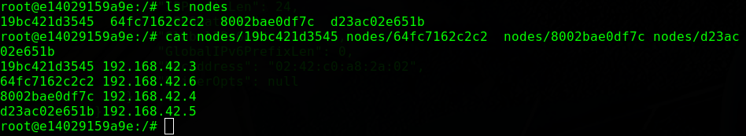

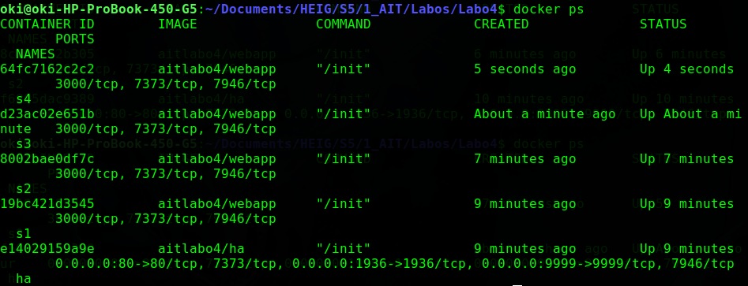

**After S1 stopped**

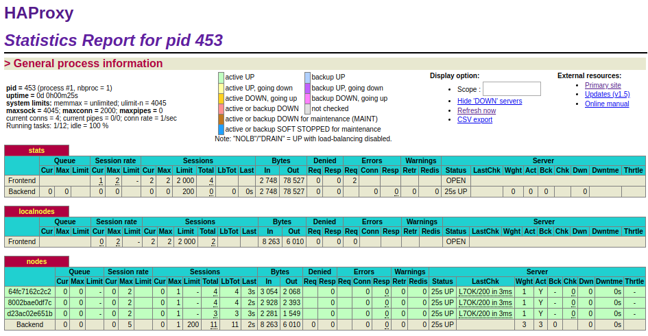

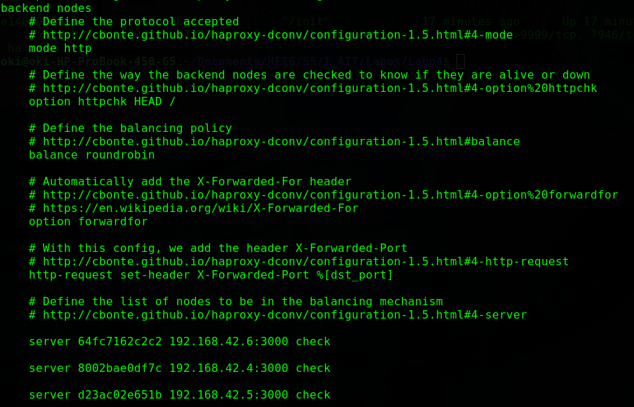

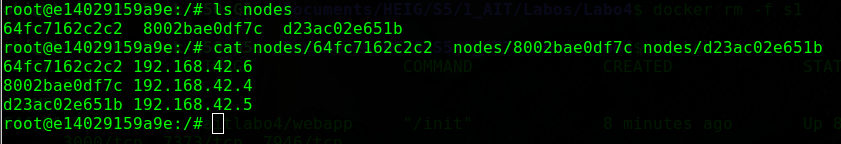

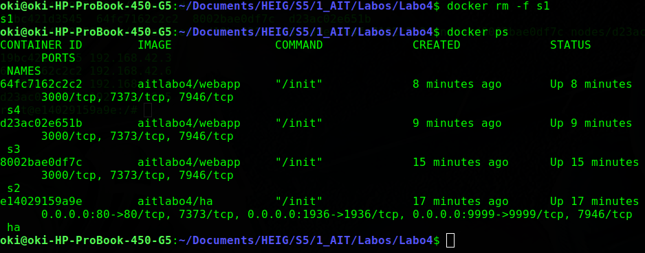


**After S5 and S6 started**

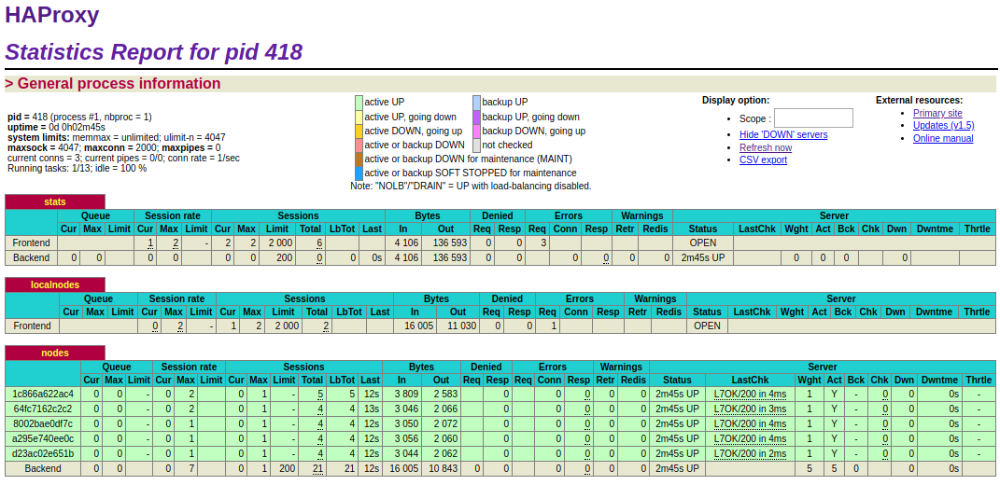

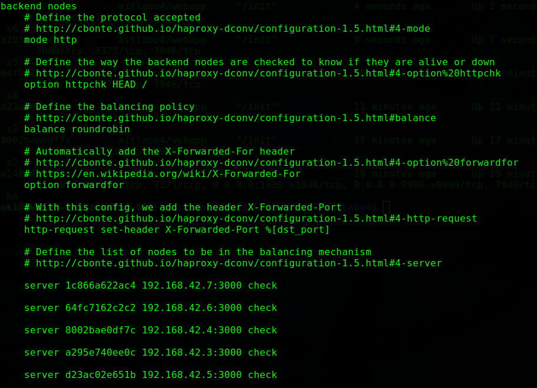

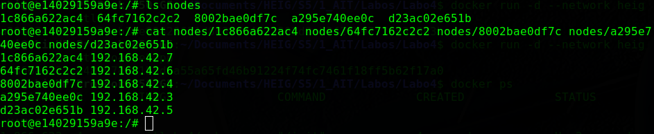

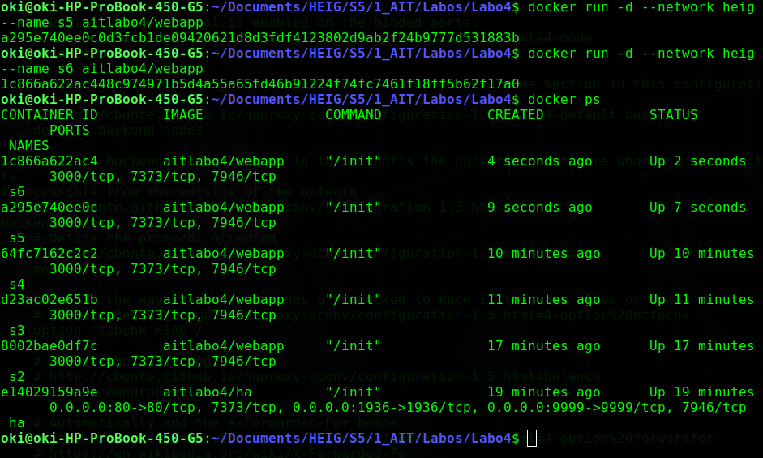

**Give your own feelings about the final solution. Propose improvements or ways to do the things differently. If any, provide references to your readings for the improvements.**

We think that the current solution is good for a small business because it's pretty easy and quick to implement.<br/>
But in the case of a bigger business, a solution with "zero downtime" should be use to get better performances and stability.

HAProxy actually doesn't support "zero downtime".<br/>
Instead, it supports fast reloads where a new HAProxy instance starts up, attempts to use SO_REUSEPORT to bind to the same ports that the old HAProxy is listening to and sends a signal to the old HAProxy instance to shut down.<br/>
It is possible to configure HAProxy in a real "zero downtime" mode. In order to do this, one possibility is to use the "delay SYN" technique that is well explained [here](https://engineeringblog.yelp.com/2015/04/true-zero-downtime-haproxy-reloads.html).<br/>
In a few words, this technique allows to simulate a zero down time for the client by dropping the SYN packet from the client rather than send back a RST when the HAProxy is restarting. With this mechanism, the client never get a 40X or 50X response from server.

**(Optional:) Present a live demo where you add and remove a backend container.**

[Demo](./demo/demo_live_AIT_Labo4.webm)

## Difficulties <a name="difficulties"></a>
There was no big difficulties because steps are well documented and easy to understand. However, the understanding of Serf mechanisms was the hardest task for us for this lab.

## Conclusion <a name="conclusion"></a>

This project showed us how it's easy and quick to install and configure a dynamic HA Proxy for a small business.<br/>
It also allowed us to understand mechanisms used by HA Proxy to actually make balancing between different nodes and generate dynamic configuration files by using event's informations.<br/>
We also learned about several technologies as Serf, Handlebars, etc... that can be be used for different purpose.
